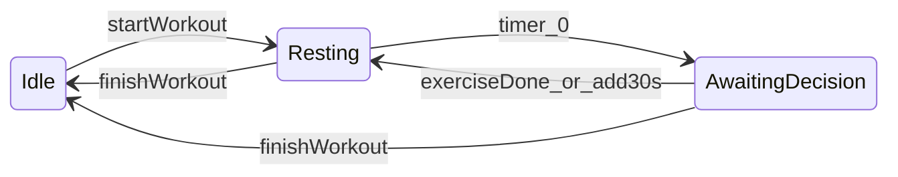

# Earn it! — guide pour les agents

## Ce que fait l’app

**Earn it!** est une app Android (Kotlin + Jetpack Compose) qui sert de minuteur de repos entre les séries de musculation.

- Pendant le repos (`Resting`) : le téléphone s’utilise normalement, aucun blocage.
- Quand le timer atteint **0:00** (`AwaitingDecision`) : les apps non autorisées sont bloquées via `AccessibilityService`. L’utilisateur choisit **Exercise done**, **+30s rest** ou **Finish workout**.
- Données **100 % locales** (DataStore) ; pas de compte, pas de backend distant, pas d’historique de séances dans le MVP.

| Identité | Valeur |
|----------|--------|
| Nom affiché | Earn it! |
| `applicationId` | `com.fitness.restlock` |
| Min SDK | 26 (Android 8.0+) |

## Règle critique : quand bloquer

Le blocage d’apps n’existe **que** en phase `AwaitingDecision`. **Jamais** en `Idle` ni `Resting`. C’est la cause #1 de bugs si on touche au backend ou à l’accessibility.



| Phase | Blocage actif |
|-------|---------------|
| `Idle` | Non |
| `Resting` | Non (décompte en cours) |
| `AwaitingDecision` | Oui (`blockerArmed = true`) |

Transitions détaillées : voir `SessionEngine` et le test `FakeSessionEngineTest`.

## Architecture

| Couche | Emplacement | Rôle |
|--------|-------------|------|
| UI + contrat | `app/src/main/kotlin/com/restlock/` | Compose, ViewModels, interfaces domaine |
| Backend Android | `app/src/main/java/com/fitness/restlock/backend/` | `WorkoutController`, DataStore, AlarmManager, Accessibility |
| Câblage | `app/src/main/kotlin/com/restlock/RestLockApp.kt` | Adapters `Backend*` → backend réel |

L’UI ne dépend que des interfaces dans `com.restlock.domain` :

- `SessionEngine` — machine d’états + commandes workout
- `SettingsRepository` — durée de repos, packages autorisés
- `InstalledAppsProvider` — apps launchables pour le picker

Pour modifier la logique session : backend + adapters (`BackendSessionEngine`, etc.), pas les écrans directement.

Point d’entrée backend : `RestLockBackend.controller(context)` → `WorkoutController`.

## Allowlist (pas blocklist)

L’utilisateur choisit les **apps autorisées** pendant le lock (libellé UX : « Apps allowed during lock »).

- **Mode strict** : liste vide → tout bloquer sauf packages système essentiels (launcher, Settings, dialer, l’app elle-même, etc.).
- Exemptions : `app/src/main/java/com/fitness/restlock/backend/blocking/KnownExemptPackages.kt`
- Politique : `app/src/main/java/com/fitness/restlock/backend/blocking/AppBlockPolicy.kt`

## Intégrations Android

| Composant | Fichier / rôle |
|-----------|----------------|
| AccessibilityService | `AppBlockerAccessibilityService.kt` — détecte le package au premier plan, `GLOBAL_ACTION_HOME`, puis ouvre `BlockerActivity` |
| Écran de décision plein écran | `app/src/main/kotlin/com/restlock/BlockerActivity.kt` |
| AlarmManager | `backend/alarm/` — réveil timer (pas de `SCHEDULE_EXACT_ALARM` dans le MVP) |
| DataStore | préférences + état de session persistant |
| AdMob (optionnel) | `app/src/main/kotlin/com/restlock/ads/CreatorSupportRewardedAd.kt` — pub récompensée après *Finish workout* ; si échec, finir la séance quand même |

Onboarding Accessibility obligatoire avant les paramètres système : `PermissionOnboardingScreen.kt`.

## Fichiers clés

**Navigation / écrans**

- `app/src/main/kotlin/com/restlock/ui/nav/RestLockNavGraph.kt`
- `ui/screens/HomeScreen.kt`, `WorkoutScreen.kt`, `AppPickerScreen.kt`, `PermissionOnboardingScreen.kt`, `BlockerScreen.kt`

**Contrat domaine**

- `domain/SessionEngine.kt`, `domain/SessionState.kt`
- `domain/SettingsRepository.kt`, `domain/InstalledAppsProvider.kt`

**Spec exécutable**

- `app/src/test/kotlin/com/restlock/domain/fake/FakeSessionEngineTest.kt`

**Backend**

- `backend/RestLockBackend.kt`
- `backend/session/DefaultWorkoutController.kt`
- `backend/WorkoutController.kt`

## Commandes

```text
.\gradlew.bat testDebugUnitTest
.\gradlew.bat assembleDebug
```

APK debug : `app/build/outputs/apk/debug/app-debug.apk`

Release : voir `README.md` (keystore dans `key/`, `keystore.properties` git-ignoré).

## Doc complémentaire

| Fichier | Usage |
|---------|-------|
| [README.md](README.md) | Layout projet, contrat `SessionEngine` |
| [BACKEND_HANDOFF.md](BACKEND_HANDOFF.md) | Handoff technique backend / frontend |
| [APP_BRIEF_FOR_AI.md](APP_BRIEF_FOR_AI.md) | Play Store, privacy, déclarations Accessibility |
| [PRIVACY_POLICY.md](PRIVACY_POLICY.md) | Politique de confidentialité |
| [GOOGLE_PLAY_DECLARATIONS.md](GOOGLE_PLAY_DECLARATIONS.md) | Déclarations console Play |

## Garde-fous

- Ne pas décrire l’app comme outil **médical** ou **kiosk** complet.
- Ne pas prétendre que le blocage a lieu **pendant** le décompte du repos.
- Ne pas ajouter `QUERY_ALL_PACKAGES` (policy Play).
- Ne pas retirer la **disclosure Accessibility** avant l’ouverture des paramètres système.
- Ne pas committer `key/keystore.properties` ni exposer les IDs AdMob de prod.
- MVP : **pas d’historique** de workouts (Room = post-MVP).
- Accessibility : utilisé uniquement pour le **nom de package** au premier plan pendant le lock, pas pour lire le contenu d’écran.
